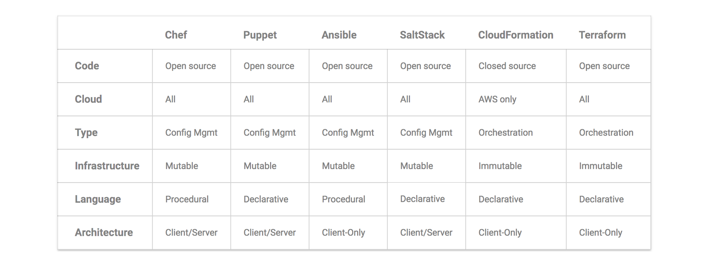

# osx screen capture and optimal aspect ratio and screen resolutions
http://www.araelium.com/screenflick
http://lifehacker.com/5880540/the-best-screen-capture-tool-for-mac-os-x
https://www.google.com/webhp?sourceid=chrome-instant&ion=1&espv=2&ie=UTF-8#q=osx%20video%20screencast%20software
http://thenextweb.com/apple/2011/01/15/how-to-record-quick-easy-screencast-videos-with-mac-osx/#gref
http://www.makeuseof.com/tag/5-best-screen-recorders-capturing-mac-os-x/
http://readwrite.com/2015/05/16/screencasting-mac-os-x-tips-tools/
https://www.google.com/search?q=optimal+youtube+aspect+ratio&oq=optimal+youtube+aspect+ratio&aqs=chrome..69i57j0.5914j0j7&sourceid=chrome&ie=UTF-8
https://support.google.com/youtube/answer/1722171?hl=en
https://www.winxdvd.com/resource/best-youtube-size-for-uploading.htm
https://support.google.com/youtube/answer/6375112

https://www.google.com/search?q=osx+display+1080p+for+screencast&oq=osx+display+1080p+for+screencast&aqs=chrome..69i57.15507j0j7&sourceid=chrome&ie=UTF-8#q=osx+display+1080p+screenflick
http://apple.stackexchange.com/questions/126332/screencasting-in-1080p-from-a-retina-display-without-scaling-possible-or-not
http://www.madrau.com/
http://apple.stackexchange.com/questions/43315/how-can-i-change-the-resolution-on-my-mac-to-720p-1280x720
http://telestreamblog.telestream.net/2011/04/choosing-the-best-screen-resolution-for-your-screencasts-2/
http://lifehacker.com/5878458/the-best-screencasting-app-for-mac-os-x
http://www.araelium.com/screenflick
http://www.araelium.com/screenflick/how-to-use
http://www.araelium.com/screenflick/remote
https://www.google.com/search?q=madrau+vs+screenresx&oq=madrau+vs+screenresx&aqs=chrome..69i57.6067j0j7&sourceid=chrome&ie=UTF-8#q=switchresx+vs
http://forums.macnn.com/82/applications/384923/displayconfigx-vs-switchresx-these-apps-screw/
https://discussions.apple.com/thread/7316005?start=0&tstart=0
http://www.madrau.com/support/support/srx_1011.html

## Recommended software, resolution & aspect ratios
Screenflick for OS X: http://www.araelium.com/screenflick
SwitchResX for OS X: http://www.madrau.com/
Optimal Youtube resolutions: https://support.google.com/youtube/answer/6375112

To fit the player perfectly, encode at these resolutions:

    - 2160p: 3840x2160
    - 1440p: 2560x1440
    - 1080p: 1920x1080
    - 720p: 1280x720
    - 480p: 854x480
    - 360p: 640x360
    - 240p: 426x240

You can adjust the fit of your video in the YouTube player after uploading your video using formatting tags: https://support.google.com/youtube/answer/146402

# leadership and feedback
https://www.google.com/webhp?sourceid=chrome-instant&ion=1&espv=2&ie=UTF-8#q=itlp%20%22feedback%20is%20a%20gift%22
https://blogs.uw.edu/karalee/category/itlp-tuesday-readings/
https://blogs.uw.edu/karalee/2015/06/30/tuesday-reading-feedback-103-asking-for-and-receiving-feedback/
http://www.morassociates.com/insight/sean-mcdonald/feedback-gift
http://www.morassociates.com/sites/default/files/MOR_Feedback_is_a_Gift_Article.pdf

# univalent foundations
https://www.google.com/search?sourceid=chrome-psyapi2&ion=1&espv=2&ie=UTF-8&q=voevodsky%20univalent%20foundations&oq=univalent%20foundations%20vo&aqs=chrome.1.69i57j0.6096j0j7
https://en.wikipedia.org/wiki/Univalent_foundations
https://homotopytypetheory.org/book/
http://www.math.ias.edu/~vladimir/Site3/Univalent_Foundations.html
http://www.math.ias.edu/~vladimir/Site3/Univalent_Foundations_files/2011_UPenn.pdf
http://www.math.ias.edu/vladimir/Univalent_Foundations
https://www.quantamagazine.org/20150519-will-computers-redefine-the-roots-of-math/

# don’t limit work in progress
Two posts on the value of limiting work in progress:

http://www.personalkanban.com/pk/primers/the-basics-of-limiting-wip-why-limit-wip-series-post-1/
Personal Kanban
PK Basics: Why Limit Your WIP Series, Post 1
In Personal Kanban we have only two rules. One of them is to limit your WIP. That sounds simple enough. But what does limiting your WIP really imply? This series describes what we mean by "WIP," why

http://www.personalkanban.com/pk/primers/slack-why-limit-wip-series-post-3/
http://brodzinski.com/2015/10/dont-limit-wip.html
 brodzinski.com
Don’t Limit Work in Progress
Limiting Work in Progress introduces slack time, drives emergent behaviors and enables continuous improvements. At the same time WIP limits are hard for many teams. Is there another way?

Tl;dr version:

    - when we’re juggling too many tasks, we can’t pay as much attention to detail, and quality suffers
    - when the code base is full of half-finished work, quality suffers
    - when we stop something and never finish it, we’ve wasted our time
    - when we stop something and then come back to it later, we waste time trying to remember what we were doing and figuring out whether requirements have changed
    - when we finish one thing before starting something else, everything gets done faster and with higher quality
    - when everything’s “in progress” we can’t tell which things are blocked
    - when we work on one thing at a time, we deliver features faster
    - when we finish everything we start, there’s more sense of accomplishment
    - when we start lots of tasks, we have a false sense of progress even when we aren’t finishing any of them
    - when we limit work in progress, we focus on finishing, not starting

## The Big Board: Simple Planning for Startups
http://williampietri.com/writing/2014/simple-planning-for-startups/

> But there is no perfect process, just the right one for you and your team at the moment. The real trick to a perfect working rhythm is to get started with some simple process now.

http://williampietri.com/writing/2015/the-big-board/#toc4

  * Specification – Specification was replaced by discussion before and during construction. I now see product specification documents as waste to be eliminated by improving communication.
  * Estimation – Other than the process where we took green cards, which were of unspecified size, and broke them down into blue cards, which were “not too big”, we didn’t do estimation. Because we were continually learning, our product plans were continuously improving. That means requirements were volatile enough that there was no point in numerical estimates for large chunks of work.
  * Code review – Code review was unnecessary because we were a pair programming shop; everything was code reviewed all the time.
  * QA – We were big fans of automated testing and site monitoring, so there wasn’t really a QA stage. I imagine that had the company lived long enough we might have added exploratory testers, but as it was we didn’t have enough in the way of bugs to justify that.
  * Deployment – And after the first couple of months we set up a continuous deployment pipeline, so committed code was automatically deployed after 10 minutes or so of automated testing. A pair would typically commit every few hours and we almost never branched, so there was no need to track when something was in the short period between “done” and “released”.

# XSEDE cloud, slash2 wan filesystem, history of pets vs cattle
http://cloudscaling.com/blog/cloud-computing/the-history-of-pets-vs-cattle/
https://www.xsede.org/chameleon-connects-to-bridges
https://www.psc.edu/index.php/research-programs/advanced-systems/slash2
https://www.psc.edu/index.php/research-programs/advanced-systems
https://github.com/pscedu/slash2/wiki
https://pscedu.github.io/slash2/
https://github.com/pscedu/slash2/wiki/FAQ
https://docs.google.com/document/d/1g7JIgczg-VkkDWxWLtKqaSvSenRAnW53_uOnefJendg/edit

# google groups api add and remove member
https://www.google.com/webhp?sourceid=chrome-instant&ion=1&espv=2&ie=UTF-8#q=google+groups+api+add+and+remove+member
https://developers.google.com/admin-sdk/groups-settings/get_started
https://developers.google.com/admin-sdk/directory/v1/reference/groups
https://developers.google.com/admin-sdk/directory/v1/guides/manage-group-members
https://developers.google.com/admin-sdk/directory/v1/reference/groups/list
https://developers.google.com/admin-sdk/directory/v1/guides/manage-groups
https://developers.google.com/admin-sdk/directory/
https://developers.google.com/admin-sdk/groups-settings/v1/reference/groups
https://developers.google.com/admin-sdk/directory/v1/guides/manage-group-members
https://developers.google.com/admin-sdk/directory/v1/reference/members/insert#try-it
https://developers.google.com/admin-sdk/directory/v1/libraries
https://stackoverflow.com/search?q=google+groups+api+list+of+email+addresses
https://stackoverflow.com/questions/21052533/auto-update-google-group-membership-per-dynamic-email-address-list-in-google-spr
http://stackoverflow.com/questions/20118937/add-emailadress-to-spreadsheet-auto-add-the-email-to-a-google-group
https://developers.google.com/admin-sdk/directory/v1/reference/members/delete
https://developers.google.com/admin-sdk/directory/v1/reference/members

# browser readability tools
https://www.google.com/search?sourceid=chrome-psyapi2&ion=1&espv=2&ie=UTF-8&q=chrome%20extensions%20clearly&oq=chrome%20extensions%20clearly&aqs=chrome..69i57.4294j0j7
https://chrome.google.com/webstore/detail/beeline-reader/ifjafammaookpiajfbedmacfldaiamgg
https://getpocket.com/
http://www.controlaltachieve.com/2016/01/clearly-alternatives.html
https://chrome.google.com/webstore/detail/readability/oknpjjbmpnndlpmnhmekjpocelpnlfdi
https://chrome.google.com/webstore/detail/easyreader/boamfheepdiallipiieadpmnklbhadhc
https://chrome.google.com/webstore/detail/read-mode/nagcaahojecfeopbghgihcabgiepploa
https://help.evernote.com/hc/en-us/articles/212952747-Discontinued-support-for-Clearly
https://www.youtube.com/watch?v=Q0sLceZAPDY
https://www.quora.com/What-are-the-Alternatives-available-for-Evernote-Clearly
http://alternativeto.net/software/evernote-clearly/
http://alternativeto.net/software/pocket/
https://getpocket.com/about
http://alternativeto.net/software/purify/
https://github.com/chaowentan/Purify
https://chrome.google.com/webstore/detail/readability/oknpjjbmpnndlpmnhmekjpocelpnlfdi?hl=en

# UC analytics channel on UCTech slack instance; learning analytics; analytics environments on demand

> ----- October 4th -----
> alcourse3 [8:40 AM]
> The Information Technology Leadership Council (ITLC) - Central IT Leadership has formed an Analytics committee to look at Analytic needs across UC.  I would like to get feedback on Analytic topics or challenges that this group should look at  Thanks, Al Course, Data Service Manager at UCOP
>
> ----- October 7th -----
> John Lynch [4:36 PM]
> @alcourse3 : Annelie Rugg (UCLA) told me that you are interested in analytics topics/challenges from across the UC.
> Here at UCLA, we have found a couple of specific challenges as we try to help our faculty implement learning analytics. We’ve discovered that, for LA to be useful as a day-to-day tool by instructors and students, most existing courses need to be heavily redesigned.
> It turns out that this usually requires much more labor from the instructor/subject matter expert as it does from the local instruct-tech staff; and most faculty with whom we speak feel that said labor is far beyond their regular job duties.
> So my team's current “conclusion” is that, if we want to implement “immediately useful" learning analytics (not to be confused with LA happening at the level of comparing final grades in courses, which is more like “delayed useful”), we need to figure out how to provide funding at a local level, but with careful oversight from trained instructional designers so that it doesn’t get misused.
> If you want any more info about the scenarios that we’re encountering, let me know. I’m happy to share.

# UX myths: Build your product based on evidence, not false beliefs
http://uxmyths.com/

# links from Devops Weekly Issue #302 - 9th October 2016

https://www.heavybit.com/library/video/every-minute-counts-coordinating-herokus-incident-response/
https://charity.wtf/2016/10/02/the-accidental-dba/
https://www.readability.com/articles/5zv7cr2d
https://blog.gruntwork.io/why-we-use-terraform-and-not-chef-puppet-ansible-saltstack-or-cloudformation-7989dad2865c#.8ohx1ek9h
https://blog.gruntwork.io/a-comprehensive-guide-to-terraform-b3d32832baca#.9idvfxxjf
https://blog.gruntwork.io/an-introduction-to-terraform-f17df9c6d180#.vqdxdbtzh
https://blog.gruntwork.io/how-to-manage-terraform-state-28f5697e68fa#.4h3i6fn92
https://blog.gruntwork.io/how-to-create-reusable-infrastructure-with-terraform-modules-25526d65f73d#.x5jt8so38
http://www.gruntwork.io/
https://blog.gruntwork.io/gruntwork-infrastructure-packages-7434dc77d0b1#.6i15cxif4
http://www.gruntwork.io/?ref=medium-gruntwork-packages#what-we-do
https://github.com/gruntwork-io/module-ecs-public
https://medium.com/@rothgar/no-sdn-kubernetes-5a0cb32070dd#.dlf6g1n8b
https://github.com/coreos/flannel#flannel
https://www.weave.works/products/weave-net/
https://github.com/projectcalico/calico-containers/blob/master/docs/cni/kubernetes/README.md
http://kubernetes.io/docs/admin/networking/
https://speakerdeck.com/caseywest/containercon-north-america-cloud-anti-patterns
https://stefanprodan.com/2016/a-monitoring-solution-for-docker-hosts-containers-and-containerized-services/
http://events.linuxfoundation.org/events/kubecon?utm_medium=email&utm_campaign=devopsweekly&utm_source=newsletter&utm_content=a
https://github.com/jessfraz/pepper
https://github.com/zentralopensource/zentral/wiki
https://github.com/cilium/cilium
http://www.devopsweekly.com/
http://www.morethanseven.net/
http://www.devopsweekly.com/archive
http://uxmyths.com/
http://uxmyths.com/post/115783813605/myth-34-simple-minimal
http://uxmyths.com/post/3897350094/myth-31-ux-design-is-a-step-in-a-project
https://github.com/garethr/devopsweekly
https://github.com/aculich/devopsweekly

## Why use Terraform?

[originally taken from](https://cdn-images-1.medium.com/max/2000/1*bVC97LGrOY4R5E4WwzMLzw.png)
a [Gruntwork blog](https://blog.gruntwork.io/) post titled
[Why we use Terraform and not Chef, Puppet, Ansible, SaltStack, or CloudFormation](https://blog.gruntwork.io/why-we-use-terraform-and-not-chef-puppet-ansible-saltstack-or-cloudformation-7989dad2865c#)

                   | Chef          | Puppet        | Ansible     | SaltStack     | Cloud Formation | Terraform
------------------ | ------------- | ------------- | ----------- | ------------- | -------------- | -----------
**Code**           | Open Source   | Open Source   | Open Source | Open Source   | Cloud Source   | Open Source
**Cloud**          | All           | All           | All         | All           | AWS only       | All
**Type**           | Config Mgmt   | Config Mgmt   | Config Mgmt | Config Mgmt   | Orchestration  | Orchestration
**Infrastructure** | Mutable       | Mutable       | Mutable     | Mutable       | Immutable      | Immutable
**Language**       | Procedural    | Declarative   | Procedural  | Declarative   | Declarative    | Declarative
**Architecture**   | Client/Server | Client/Server | Client-Only | Client/Server | Client-Only    | Client-Only

## No SDN Kubernetes
https://medium.com/@rothgar/no-sdn-kubernetes-5a0cb32070dd#.dlf6g1n8b

> Kubernetes networking has a few requirements. They are:
>   * Pods are routable on a flat network
>   * Pods should see their own routable IP address
>   * Nodes can communicate with all containers
>
> How these requirements are implemented is up to the operator. In many cases this means using a software defined network “SDN” also called an overlay network (e.g. flannel, weave, calico) or underlay network (MACvlan, IPvlan). The SDNs all accomplish the same three goals but usually with different implementation and often unique features.
>
> But the networking requirements doesn’t mean you have to run an SDN. It also means you can implement a traditional SDN product in a non-traditional way. Let’s look at the simplest solution for networking in Kubernetes.

# SciPy lecture notes
https://www.google.com/search?sourceid=chrome-psyapi2&ion=1&espv=2&ie=UTF-8&q=scientific%20python%20lecture%20notes&oq=scientific%20python%20lecture%20notes&aqs=chrome..69i57j0l4.4771j0j7
http://www.scipy-lectures.org/
http://www.scipy-lectures.org/advanced/mathematical_optimization/index.html
http://www.scipy-lectures.org/packages/statistics/index.html
http://www.scipy-lectures.org/_downloads/PythonScientific-simple.pdf
https://github.com/scipy-lectures/scipy-lecture-notes

# Terraform quickstart
https://blog.gruntwork.io/a-comprehensive-guide-to-terraform-b3d32832baca#.a1wjlk947
https://blog.gruntwork.io/an-introduction-to-terraform-f17df9c6d180#.puvxubxc4
https://blog.gruntwork.io/how-to-manage-terraform-state-28f5697e68fa#.gtoswi240
https://blog.gruntwork.io/how-to-create-reusable-infrastructure-with-terraform-modules-25526d65f73d#.oayz8i2gf

# Terraform, AWS, Google Cloud Shell, Kubernetes, Kubeform
https://blog.gruntwork.io/an-introduction-to-terraform-f17df9c6d180#.up990y4ec
https://www.google.com/webhp?sourceid=chrome-instant&ion=1&espv=2&ie=UTF-8#q=terraform%20tutorial%20google%20cloud
https://www.terraform.io/docs/providers/google/
https://github.com/hashicorp/terraform/tree/master/examples/google-two-tier
https://lincolnloop.com/blog/provision-cluster-google-cloud-terraform/
https://opencredo.com/terraform-infrastructure-design-patterns/
https://www.google.com/webhp?sourceid=chrome-instant&ion=1&espv=2&ie=UTF-8#q=terraform%20kubernetes
http://solinea.com/blog/deploying-kubernetes-ansible-terraform
https://github.com/bakins/kubernetes-coreos-terraform
https://github.com/kz8s/tack
https://github.com/maxmanuylov/terraform-provider-kubernetes
https://opencredo.com/kubernetes-aws-terraform-ansible-2/
https://capgemini.github.io/devops/kubeform/
https://github.com/Capgemini/kubeform
https://github.com/Capgemini/kubeform/blob/master/docs/roadmap.md
https://github.com/Capgemini/Apollo
https://mesos.apache.org/
https://github.com/kubernetes/kubernetes/issues/23174
https://capgemini.github.io/drupal/considering-drupal-8-upgrade/
https://www.drupal.org/8/
https://capgemini.github.io/drupal/minimum-viable-redesign/
https://cloud.google.com/compute/
https://github.com/kubernetes/dashboard
https://opencredo.com/kubernetes-aws-terraform-ansible-1/
http://www.devoperandi.com/kubernetesterraform-multiple-availability-zone-deployments/
http://blog.kubernetes.io/2015/12/how-Weave-built-a-multi-deployment-solution-for-Scope-using-Kubernetes.html
https://www.google.com/webhp?sourceid=chrome-instant&ion=1&espv=2&ie=UTF-8#q=kubernetes+%22google+cloud+shell%22
http://kubernetes.io/docs/hellonode/
https://cloud.google.com/container-engine/docs/quickstart
https://cloud.google.com/shell/
http://omerio.com/2016/01/02/getting-started-with-kubernetes-on-google-container-engine/
https://deis.com/blog/2016/first-kubernetes-cluster-gke/
https://github.com/kelseyhightower/craft-kubernetes-workshop/blob/master/labs/enable-and-explore-cloud-shell.md
https://github.com/kelseyhightower/craft-kubernetes-workshop/tree/master/labs
https://github.com/kelseyhightower/craft-kubernetes-workshop
https://github.com/aculich/craft-kubernetes-workshop
https://github.com/kelseyhightower/craft-kubernetes-workshop/blob/master/labs/provisioning-ubuntu-on-gce.md
https://github.com/kelseyhightower/craft-kubernetes-workshop/blob/master/labs/install-and-configure-docker.md
https://github.com/kelseyhightower/craft-kubernetes-workshop/blob/master/labs/configure-networking.md
https://esciencegroup.com/2016/08/18/kubernetes-and-the-google-cloud-container-service-fun-with-pods-of-celery/
http://omerio.com/2015/11/17/building-testing-docker-containers-using-google-cloud-shell/
